  
  
  

---

## 🚀 Current Focus

- 🤖 **AI Agent** — Engineering and productionizing agentic applications
- 🧠 **LLM Applications** — Building applications on large language models
- ⚙️ **LangGraph Workflow** — Agent workflow orchestration
- 📊 **Risk MLOps Platform** — End-to-end MLOps for risk control scenarios
- ⚡ **ETL Performance Optimization** — ETL pipeline analysis and tuning
- ☁️ **Distributed Systems** — Designing and scaling distributed systems

---

## 🛠 Tech Stack

**Backend**

**Big Data**

**AI**

**Cloud & DevOps**

---

## ⭐ Featured Projects

| Project | Description | Tech |
|---------|-------------|------|
| [**liquid-glass**](https://github.com/ccl125/liquid-glass) | Apple-style liquid glass for the web: real refraction lens for `backdrop-filter` (SVG displacement map + chromatic dispersion). Vanilla core + React wrapper, zero deps |  |
| [**yqg-git-ai**](https://github.com/ccl125/yqg-git-ai) | AI-powered Git CLI assistant for automated branch management, cherry-pick, release, and code review |  |
| [**mini-spring**](https://github.com/ccl125/mini-spring) | A simplified Spring framework for learning its core principles: IoC, AOP, resource loading, bean lifecycle, and application context |  |
| [**ccl-leetcode**](https://github.com/ccl125/ccl-leetcode) | LeetCode solutions and interview preparation notes |  |

---

## 📈 GitHub Stats

  
   
  
  
   
  
  
   
  

---

## 🐍 Contribution Snake

<picture>
  <source media="(prefers-color-scheme: dark)" srcset="https://raw.githubusercontent.com/ccl125/ccl125/output/github-contribution-grid-snake-dark.svg" />
  <source media="(prefers-color-scheme: light)" srcset="https://raw.githubusercontent.com/ccl125/ccl125/output/github-contribution-grid-snake.svg" />
  
</picture>

---

## 📫 Contact

- 📧 Email: [ccl12538@163.com](mailto:ccl12538@163.com)

  

